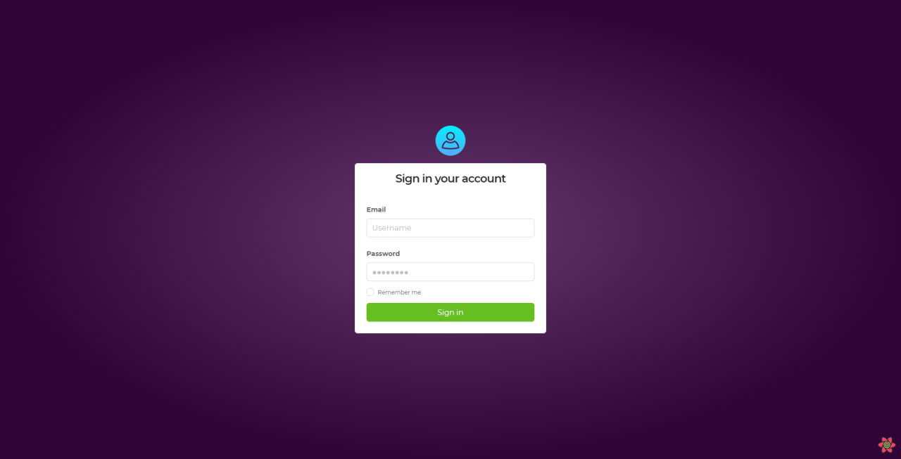
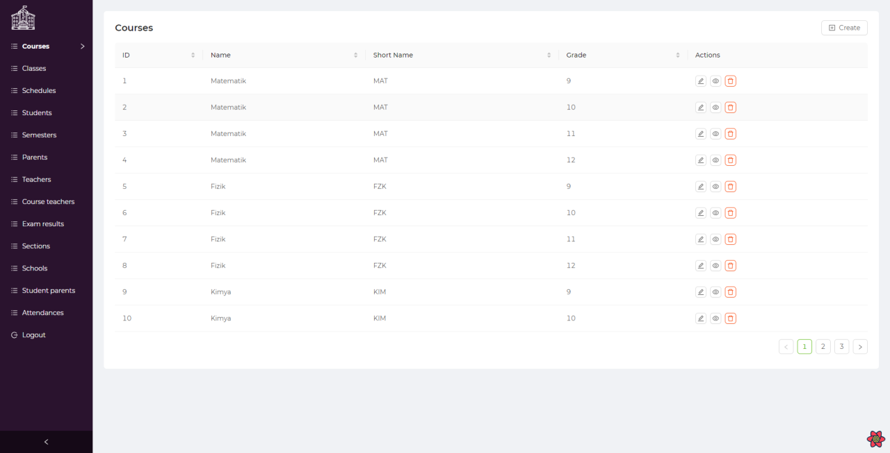
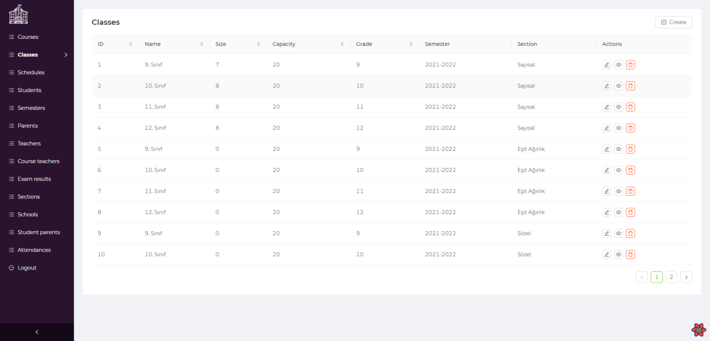
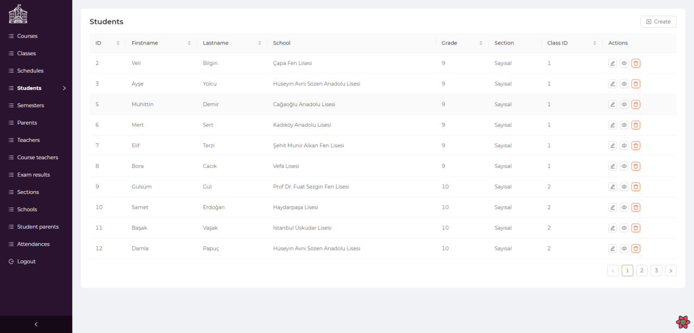
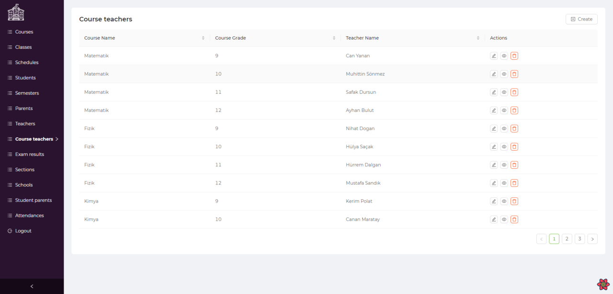
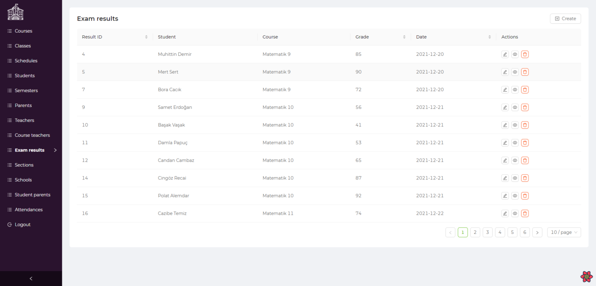

# Course Management System
You can use this course management system to manage your students, teachers, parents,
classes, timetable of classes, exam grades and attendance records.

## Installing
```bash
pip install -r requirements.txt
cd frontend
npm install
```

## Running
```bash
uvicorn app:app --reload
cd frontend
npm run dev
```

## Preview

*Login Page*


*Courses Page*


*Classes Page*


*Students Page*


*Course Teachers Page*


*Exam Results Page*

## Credits
- [Refine](https://github.com/pankod/refine)
- [FastAPI](https://github.com/tiangolo/fastapi)